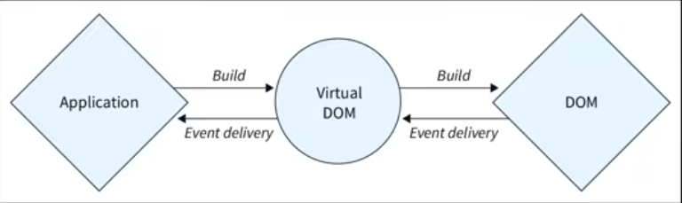
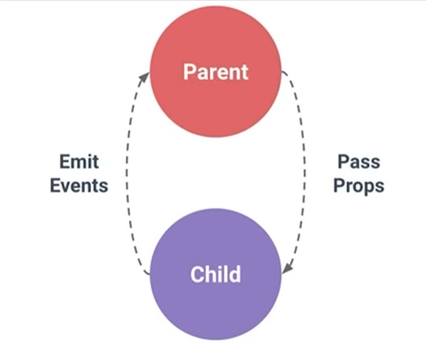

# Passing Data via Props

A React learning project demonstrating how to use props for passing data between components.

## What are Props?

**Props** (short for properties) are a fundamental concept in React that allow you to pass data from parent to child components.

### Key Characteristics

- **Short for properties** - Props are like function parameters in React
- **Mechanism for passing data** - Transfer information between components
- **Read-only by default** - Props are immutable and cannot be modified by child components

## Why Use Props?

- **Reusability** - Makes components reusable across your application
- **Component Communication** - Enable parent-to-child data flow
- **Maintainability** - Centralize data management in parent components

## How Props Work

### Usage Pattern

```jsx
// Passing props from parent component
<FoodItems items={foodItems} />

// Receiving props in child component
function FoodItems({ items }) {
  return (
    <div>
      {items.map((item) => (
        <p key={item}>{item}</p>
      ))}
    </div>
  );
}
```

### Key Points

- **Data flows one-way** (downwards) - From parent to child only
- **Props are immutable** - Child components cannot modify props directly
- **Used for component communication** - Defines component interfaces

## Practical Work Done in This Folder

For practical understanding, visit these files:

- Parent component with the `foodItems` array and prop passing:
  [src/App.jsx](src/App.jsx)
- List rendering component that receives `items` and maps them into `Item` components:
  [src/components/FoodItems.jsx](src/components/FoodItems.jsx)
- Single item component that displays one food item:
  [src/components/Item.jsx](src/components/Item.jsx)
- Conditional message component that checks whether the list is empty:
  [src/components/ErrorMessage.jsx](src/components/ErrorMessage.jsx)

## Example

This project uses props to pass the food list from the parent component to child components:

```jsx
function App() {
  let foodItems = ["Dal", "Green Vegetables", "Roti", "Salad", "Milk", "Ghee"];

  return (
    <>
      <ErrorMessage items={foodItems} />
      <FoodItems items={foodItems} />
    </>
  );
}
```

The `FoodItems` component loops through the array and renders each value as a separate list item, while `ErrorMessage` shows a message when the list is empty.

---

# CSS Modules

A React learning project demonstrating CSS Modules for scoped, component-specific styling.

## What are CSS Modules?

**CSS Modules** are stylesheets where all class names and animations are scoped locally to a component by default. This prevents naming conflicts and allows styles to be tightly coupled with components.

### Key Characteristics

- **Scoped class names** - Each class is unique to its component, avoiding global conflicts
- **Locally scoped** - Styles are only applied to the component importing them
- **Unique naming** - CSS modules automatically generate unique class names at build time
- **Component-specific** - Promotes modular and maintainable styling

## Why Use CSS Modules?

- **Avoid naming conflicts** - No need to worry about class name collisions globally
- **Better organization** - Keep styles with their components
- **Reusable components** - Safe to copy components without style conflicts
- **Maintainability** - Easy to modify styles without affecting other parts of the app
- **Flexibility** - Can be used alongside global CSS when needed

## How CSS Modules Work

### 1. Create a CSS Module File

```css
/* Item.module.css */
.my-item {
  background-color: khaki;
  padding: 10px;
  border-radius: 4px;
}
```

### 2. Import in Component

```jsx
import styles from './Item.module.css';

export default function Item() {
  return <li className={styles.my-item}>Food Item</li>;
}
```

### 3. Generated Output

The build tool automatically transforms the class name to a unique identifier:

```css
/* Generated in browser */
._my-item_j3xk {
  background-color: khaki;
  padding: 10px;
  border-radius: 4px;
}
```

## Practical Work Done in This Folder

For practical understanding, visit these files:

- Component using CSS modules for scoped styling:
  [src/components/Item.jsx](src/components/Item.jsx)
- CSS module file with scoped styles:
  [src/components/Item.module.css](src/components/Item.module.css)

---

# Passing Children

A React learning project demonstrating how to pass content as children to components, enabling flexible and reusable component composition.

## What are Children?

**Children** in React refer to content passed between opening and closing tags of a component. The `children` prop is a special prop that allows you to pass JSX elements, text, or other React components to a child component, making it a container or wrapper component.

> 💡 **Key Points:**
> - **children is a special prop** for passing elements into components
> - **Accessed with `props.children`** to render the passed content

### Key Characteristics

- **Special built-in prop** - `children` is automatically available to all components
- **Flexible content** - Accept any React elements, text, or combinations
- **Wrapper components** - Useful for creating layout or container components
- **Composition over inheritance** - Enables flexible component composition patterns

## Why Use Children?

- **Flexible components** - Create generic wrapper or layout components
- **Composition** - Build complex UIs by composing smaller components
- **Reusability** - Same component can wrap different content
- **Cleaner API** - More intuitive than passing content as named props
- **Layout flexibility** - Easily create card, modal, panel, or container components

## How Children Work

### 1. Accessing Children

```jsx
// Parent component passing content as children
<Card>
  <h2>Hello</h2>
  <p>This is card content</p>
</Card>

// Child component receiving children
function Card({ children }) {
  return (
    <div className="card">
      <div className="card-body">
        {children}
      </div>
    </div>
  );
}
```

### 2. Rendering Children

```jsx
// Simple wrapper component
function Wrapper({ children }) {
  return <div className="wrapper">{children}</div>;
}

// Using the component
<Wrapper>
  <p>This content is wrapped!</p>
</Wrapper>
```

### Key Points

- **Children are passed implicitly** - No need to explicitly name them
- **Available via the `children` prop** - Access using destructuring or `props.children`
- **Can be any content** - Text, elements, components, or even functions (render props pattern)
- **Composition enabler** - Allows building flexible, reusable wrapper components

## Practical Work Done in This Folder

### Container Component Example

A practical example of passing children is implemented using the `Container` component:

**Container Component** - [src/components/Container.jsx](src/components/Container.jsx)

```jsx
import styles from "./Container.module.css";

const Container = (props) => {
  return <div className={styles.container}>{props.children}</div>;
};

export default Container;
```

This is a simple wrapper component that:
- Accepts any content passed between its opening and closing tags as `children`
- Renders the children inside a styled `<div>` with CSS module styling
- Can be reused multiple times to wrap different content

**Usage in App Component** - [src/App.jsx](src/App.jsx)

```jsx
function App() {
  let foodItems = ["Dal", "Green Vegetables", "Roti", "Salad", "Milk", "Ghee"];

  return (
    <>
      <Container>
        <h1 className="food-heading">Healthy Food</h1>
        <ErrorMessage items={foodItems}></ErrorMessage>
        <FoodItems items={foodItems}></FoodItems>
      </Container>

      <Container>
        <p>
          Above is the list of healthy foods that are good for your health and
          well being.
        </p>
      </Container>
    </>
  );
}
```

### How It Works

1. **First Container** wraps the heading, error message, and food items list
2. **Second Container** wraps a descriptive paragraph
3. Both containers automatically style their children with the same CSS module styling (`Container.module.css`)
4. The `children` prop allows the same component to be reused with different content

This demonstrates how children enable **flexible and reusable component composition** — the `Container` component doesn't need to know what content it will receive; it simply wraps and styles whatever is passed to it.

---

# Handling Events



A React learning project demonstrating how to handle user interactions with event handlers in components.

## What are Events?

**Events** in React are user actions such as clicking buttons or typing in inputs. React lets you respond to these actions using event handler functions.

### Key Characteristics

- **CamelCase event names** - React uses `onClick`, `onChange`, and similar handlers
- **Synthetic events** - React wraps browser events with its own event system
- **Handler functions** - Event logic is usually placed inside a function
- **Common for forms and buttons** - Useful for inputs, clicks and other interactions

## Why Use Event Handlers?

- **User interaction** - Respond to clicks, typing and other actions
- **Dynamic behavior** - Update the UI based on user input
- **Cleaner code** - Keep logic inside named functions instead of inline code
- **Reusable logic** - Reuse the same handler in multiple places when needed

## How Events Work

### 1. Handling Button Clicks

```jsx
const handleBuyButtonClicked = (event) => {
  console.log(event);
  console.log(`${foodItem} being bought`);
};

<button onClick={(event) => handleBuyButtonClicked(event)}>
  Buy
</button>
```

### 2. Handling Input Changes

```jsx
const handleOnChange = (event) => {
  console.log(event.target.value);
};

<input type="text" onChange={handleOnChange} />
```

### Key Points

- **onClick** is used for button clicks and similar actions
- **onChange** is used when input values change
- **Event object** gives access to details like `event.target.value`
- **Handlers can be arrow functions or normal functions**

## Practical Work Done in This Folder

For practical understanding, visit these files:

- Button click event handling in the food item component:
  [src/components/Item.jsx](src/components/Item.jsx)
- Input change event handling in the food input component:
  [src/components/FoodInput.jsx](src/components/FoodInput.jsx)
- App component that combines props, children and event-handling examples:
  [src/App.jsx](src/App.jsx)

## Example

This project uses event handlers to respond to user actions in the UI:

```jsx
function Item({ foodItem }) {
  const handleBuyButtonClicked = (event) => {
    console.log(event);
    console.log(`${foodItem} being bought`);
  };

  return (
    <button onClick={(event) => handleBuyButtonClicked(event)}>
      Buy
    </button>
  );
}
```

The `FoodInput` component uses `onChange` to read the current input value, while `Item` uses `onClick` to handle button clicks. This makes the app interactive and shows how React event handlers connect UI actions to JavaScript logic.


---

# Passing Functions via Props



A React learning topic showing how a parent component can pass function references to child components for handling events and interactions.

## What is Passing Functions via Props?

Passing functions via props means sending a function from a parent component to a child component, then calling that function inside the child (usually on an event like click or change).

### Key Characteristics

- **Dynamic behavior sharing** - Move action logic from child to parent when needed
- **Upward communication pattern** - Child can trigger parent-defined behavior
- **Event-driven usage** - Common with `onClick`, `onChange`, and form events
- **Reusable child components** - Child receives behavior as a prop instead of hardcoding logic

## Why Use It?

- **Separation of concerns** - UI in child, business logic in parent
- **Reusability** - Same child component can perform different actions
- **Parent control** - Parent decides what should happen on user interaction
- **Better composition** - Easier to connect components in larger UIs

## How It Works

### 1. Parent Defines Function and Passes It

```jsx
function App() {
  const handleOnChange = (event) => {
    console.log(event.target.value);
  };

  return <FoodInput handleOnChange={handleOnChange} />;
}
```

### 2. Child Receives Function as Prop

```jsx
const FoodInput = ({ handleOnChange }) => {
  return <input type="text" onChange={handleOnChange} />;
};
```

### 3. Parent Passes Per-Item Function to Child in a List

```jsx
<Item
  key={item}
  foodItem={item}
  handleBuyButton={() => console.log(`${item} bought`)}
/>
```

### 4. Child Invokes Passed Function

```jsx
const Item = ({ foodItem, handleBuyButton }) => {
  return <button onClick={handleBuyButton}>Buy</button>;
};
```

### Key Points

- **Parent defines, child calls** - The function is created in parent and invoked in child
- **Function is passed by reference** - Do not call it immediately while passing
- **Useful for event handlers** - Keeps event logic flexible and organized

## Practical Work Done in This Folder

For practical understanding, visit these files:

- Parent function definition and prop passing to input component:
  [src/App.jsx](src/App.jsx)
- Child input component receiving `handleOnChange` function prop:
  [src/components/FoodInput.jsx](src/components/FoodInput.jsx)
- List component passing `handleBuyButton` function prop to each item:
  [src/components/FoodItems.jsx](src/components/FoodItems.jsx)
- Item component invoking function prop on button click:
  [src/components/Item.jsx](src/components/Item.jsx)

## Example

```jsx
// Parent
<Item foodItem={item} handleBuyButton={() => console.log(`${item} bought`)} />

// Child
const Item = ({ foodItem, handleBuyButton }) => {
  return <button onClick={handleBuyButton}>Buy</button>;
};
```

This pattern makes components more interactive and reusable by allowing behavior to be injected through props.