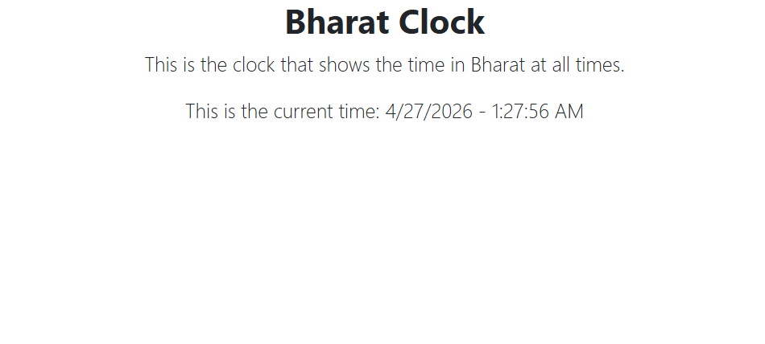

# Bharat Clock Version One

This is a beginner React project created with Vite.
It is the first version of a Bharat Clock UI.

## What We Built

1. Created a simple clock app layout using React components.
2. Added Bootstrap classes for heading and text styling.
3. Displayed current date and time using JavaScript Date.
4. Split the UI into small, clear component files.

## File Wise Work

- src/main.jsx
	- React app entry point.
	- Renders the main App component.

- src/App.jsx
	- Main layout component.
	- Combines ClockHeading, ClockSlogan and CurrentTime.
	- Imports Bootstrap and App.css.

- src/App.css
	- Project stylesheet file for custom styling.
	- Currently empty in this version.

- src/components/ClockHeading.jsx
	- Shows the main heading: Bharat Clock.

- src/components/ClockSlogan.jsx
	- Shows the app slogan/description line.

- src/components/CurrentTime.jsx
	- Creates a Date object.
	- Displays current date and time using toLocaleDateString and toLocaleTimeString.

## Current Limitation

This is a basic first version.
We have to refresh the page every time to see updated seconds.
Also, the current UI looks incomplete.

In upcoming advanced topics, we will learn state and effects to update time continuously.

## Run The Project

```bash
npm install
npm run dev
```
