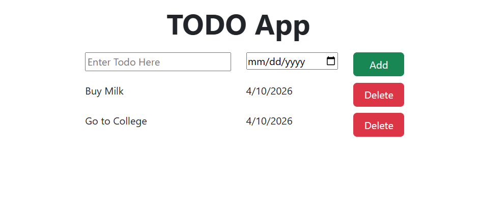

# Todo App Version Two

This is an updated beginner React project created with Vite — Version Two of the Todo App UI.

## What We Built

1. A Todo App layout composed from small React components.
2. Bootstrap for grid and button styling.
3. Component-level CSS using CSS Modules for scoped styles.
4. Reusable components and props-based rendering to avoid repetition.

## File Wise Work

- src/main.jsx
	- React app entry point. Imports Bootstrap CSS and renders `App`.

- src/App.jsx
	- Main layout component.
	- Holds a `todoItems` array and passes it to `TodoItems`.

- src/App.css
	- App-level styles (container spacing, global helpers used by components).

- src/components/AppName.jsx
	- Shows the title using a CSS Module (`AppName.module.css`).

- src/components/AddTodo.jsx
	- Input section for todo text and due date with an Add button (UI only).

- src/components/TodoItem.jsx
	- Single reusable todo item component that receives `todoName` and `todoDate` as props.

- src/components/TodoItems.jsx
	- Container that maps over an array of todo objects and renders `TodoItem` for each.
	- Uses `TodoItems.module.css` for scoped layout of the items list.

## What's New in Version Two (compared to Version One)

- Replaced duplicated components (`TodoItem1.jsx`, `TodoItem2.jsx`) with a single reusable `TodoItem.jsx`.
- Added `TodoItems.jsx` which maps over a data array to render items instead of hardcoding each one.
- Introduced CSS Modules (`AppName.module.css`, `TodoItems.module.css`) for component-scoped styles.
- `App.jsx` now contains a `todoItems` data array and demonstrates passing props to child components.
- Overall reduced repetition and improved component reusability and structure.

## Current Limitations

- The Add and Delete buttons are UI-only and do not modify state yet.
- Data is still hardcoded in `App.jsx` (an array) — next steps would add state and persistence.

## Run The Project

```bash
npm install
npm run dev
```
