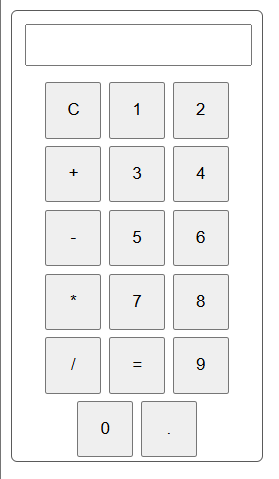

# Calculator Version One



This is a beginner React project created with Vite.
It is the first version of a Calculator UI.

## What We Built

1. A simple calculator UI using React components and CSS Modules.
2. A `Display` component that shows an input field for the current value.
3. A `ButtonsContainer` component that renders calculator buttons by mapping over an array.
4. Component-level styles using CSS Modules (`Display.module.css`, `ButtonsContainer.module.css`).

## File Wise Work

- src/main.jsx
	- React app entry point. Renders the main `App` component.

- src/App.jsx
	- Main layout component. Composes `Display` and `ButtonsContainer` and imports `App.module.css`.

- src/App.module.css
	- App-level layout and calculator container styles.

- src/components/Display.jsx
	- Stateless input field used as the calculator display. Styled with `Display.module.css`.

- src/components/ButtonsContainer.jsx
	- Renders all calculator buttons from a `buttonNames` array (includes digits, operators, `C`, `=` and `.`).
	- Buttons are styled with `ButtonsContainer.module.css`.

## Current Limitation

- The UI is presentational only: buttons do not have event handlers, and there is no state or calculation logic yet.
- The display input does not reflect button presses; data is still static.

In future updates we will add state management, button handlers, and calculation logic.

## Run The Project

```bash
npm install
npm run dev
```
